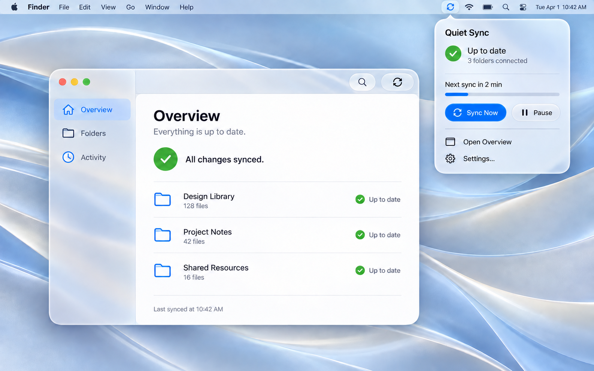
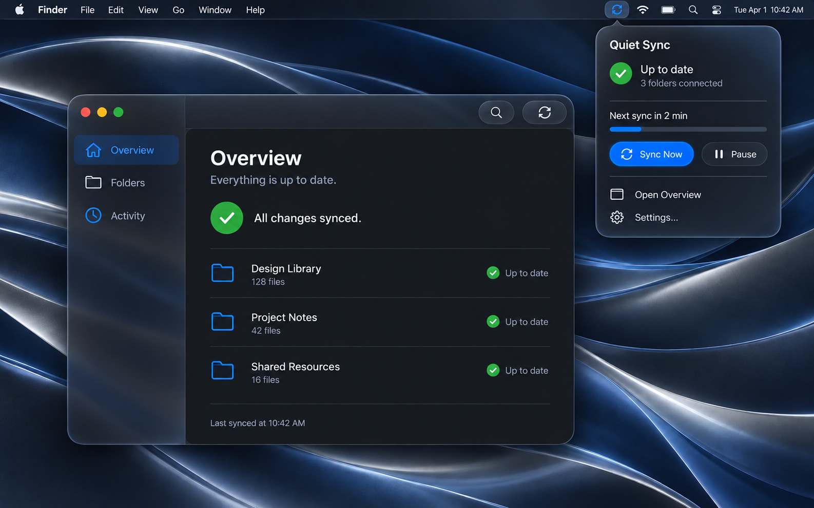

<picture>
  <source media="(prefers-color-scheme: dark)" srcset="docs/images/macos27-dark.png">
  
</picture>

<p align="center"><sub>macOS 27 design study · AI-generated mockup · Fictional data</sub></p>

<p align="center">
  <a href="https://github.com/WXK-AI/apple-menubar-design/actions/workflows/validate.yml"></a>
  <a href="LICENSE"></a>
  <a href="skills/apple-menubar-design/SKILL.md"></a>
  <a href="https://developer.apple.com/design/human-interface-guidelines/"></a>
</p>

# Apple Menu Bar Design

**A focused Codex skill for designing, implementing, and reviewing native macOS interfaces—with a macOS 27 visual baseline.**

Turn a product brief into thoughtful menu bar behavior, useful companion windows, clear Settings, and accessible interactions. The skill combines Apple’s Human Interface Guidelines with practical SwiftUI/AppKit considerations—and keeps recommendations separate from API requirements.

[Install](#install) · [Try it](#try-it) · [Preview](#interface-preview) · [Read the skill](skills/apple-menubar-design/SKILL.md) · [Sources](skills/apple-menubar-design/references/sources.md)

## What it helps you decide

| Question | Guidance |
| --- | --- |
| Should this be a menu, popover, or window? | Choose the surface by the task, complexity, and persistence needed. |
| What makes the interface feel at home on Mac? | Native controls, keyboard conventions, semantic styles, and deliberate window behavior. |
| How should a menu bar utility behave? | Status-item sizing, visibility, dismissal, activation, Settings, and background lifecycle. |
| How do I make dense information understandable? | Clear units, supported filters, honest missing-data states, and inspectable details. |
| How do I know the result works? | Focused build checks, rendered inspection, and tests of affected interactions. |

The skill targets **macOS**. It does not turn websites into imitation Mac apps, prescribe one visual style, or promise that a screenshot proves accessibility.

## Install

### With Codex

Paste this into Codex:

```text
Use skill-installer to install the skill from
https://github.com/WXK-AI/apple-menubar-design/tree/main/skills/apple-menubar-design
```

The installable directory is `skills/apple-menubar-design`. The repository's README, images, and development tooling stay outside the installed skill.

### Manually

Requires Git and Python 3. Run from a directory where you want to keep the repository:

```sh
git clone https://github.com/WXK-AI/apple-menubar-design.git
cd apple-menubar-design
python3 scripts/install.py
```

The installer copies the skill into `$CODEX_HOME/skills` when configured, otherwise `~/.codex/skills`. It refuses to overwrite an existing installation. To update, review the new version and move or remove the old skill directory first.

The skill should be available on your next Codex turn. Invoke it explicitly with `$apple-menubar-design`, or let Codex select it for a relevant request.

## Try it

**Design a focused utility**

```text
Use $apple-menubar-design to design a macOS menu bar utility for a focus timer.
Target macOS 14+. Prioritize starting, pausing, and checking time remaining.
Choose appropriate surfaces and describe the important interaction states.
```

**Improve an existing implementation**

```text
Use $apple-menubar-design to improve this SwiftUI menu bar app.
Preserve its features and deployment target. Inspect the current code,
implement the relevant improvements, and verify the affected interactions.
```

**Review before shipping**

```text
Use $apple-menubar-design to review these macOS screenshots and UI source.
Prioritize findings by user impact. Separate visible problems from behavior
that needs runtime testing, and cite relevant Apple guidance.
```

## Interface preview

The current visual direction follows Apple's **macOS 27** references: refined Liquid Glass, clearer optical edges, unified toolbars, and sidebars that reach the window edges. Glass defines the navigation and controls; the content remains calm and readable.

### Light appearance


### Dark appearance



These are **AI-generated design mockups**, not screenshots captured on macOS 27 or a working app. They visualize a fictional Quiet Sync utility and do not establish exact system geometry or runtime behavior. For a few simple commands, a native menu remains the starting choice; a richer extra needs a task-based justification.

Read the [visual direction and generation notes](docs/VISUALS.md) for the Apple references, appearance decisions, and production method. Native implementation should use the target SDK and be checked on macOS 27, including its contrast and transparency settings.

## Inside the skill

The entrypoint stays focused. Detailed references load only when relevant to the task.

```text
skills/apple-menubar-design/
├── SKILL.md
├── agents/openai.yaml
└── references/
    ├── menubar.md           # Surfaces, APIs, and lifecycle
    ├── interface.md         # Windows, appearance, and accessibility
    ├── langfuse-lessons.md  # Technical evidence only
    ├── verification.md      # Checks matched to changed behavior
    └── sources.md           # Apple documentation and freshness
```

### Design principles

- **Task before surface.** Start with a menu for simple commands; use richer surfaces when the work warrants them.
- **Behavior before decoration.** Focus, dismissal, keyboard access, and resizing belong in the design.
- **Native before custom.** Preserve platform affordances while allowing a product's identity to emerge.
- **Meaning before density.** Essential labels, units, states, and actions must remain understandable.
- **Evidence before claims.** Verify API availability and distinguish recommendations, technical observations, and design judgment.

The Langfuse reference contributes technical lessons about state, status-label sizing, data capabilities, and multiple windows. **Its visual design is not a template or recommendation.**

## Quality and maintenance

CI validates skill metadata, local Markdown references, source privacy boundaries, image integrity, and installer behavior. Run the same checks locally:

```sh
python3 -m venv .venv
.venv/bin/python -m pip install -r requirements-dev.txt
.venv/bin/python scripts/validate.py
```

These are packaging checks, not proof that generated interfaces will meet every usability or accessibility requirement. The skill directs the agent to inspect and test the actual work.

Apple sources were checked on **September 15, 2026**. OS-specific behavior and APIs should be rechecked when used. Corrections backed by a current Apple source or a reproducible macOS example are welcome—see [CONTRIBUTING.md](CONTRIBUTING.md).

## Attribution and license

Original skill text, documentation, and example code are available under the [MIT license](LICENSE). Apple documentation is linked and summarized, not redistributed as a manual. Apple names, marks, system assets, and documentation remain subject to their respective rights and terms.

This is an independent project. It is not affiliated with or endorsed by Apple or OpenAI.
